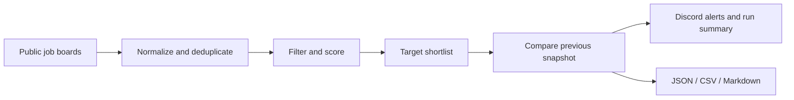

# Global Internship Hunter

[](https://github.com/jzikim/global-internship-hunter/actions/workflows/update_jobs.yml)
[](https://github.com/jzikim/global-internship-hunter/actions/workflows/tests.yml)

An automated internship tracker for an Economics & Data Science student at UW–Madison. It collects public job postings, prioritizes business and analytics opportunities, and sends new target matches to Discord.

**Python · Greenhouse / Lever / Ashby · Rule-based ranking · GitHub Actions · Discord**

## Browse the results

- [Target matches](data/target_jobs.md) — preferred-country, early-career business roles.
- [New target matches](data/new_target_jobs.md) — changes from the previous complete collection.
- [All ranked postings](data/jobs.md) — broader results, including lower-priority roles.
- [Latest run](data/latest_run.json) — timestamp, source coverage, counts, and Discord summary status.

Results are generated from configured company boards; they are not a complete global vacancy search.

## How it works



The tracker uses transparent rules and configurable weights. It does not call an LLM or paid API. The `ai_candidates` files are a rule-based export for possible later review.

## Countries and roles

**Preferred countries:** Singapore, Australia, Canada, United Arab Emirates, Qatar, Saudi Arabia, and South Korea.

**Role focus:** strategy, business operations, business development, partnerships, marketing, finance, investment, consulting, supply chain, and business/data analytics. Technical and experienced roles receive penalties or are excluded from stricter shortlists.

Preferences, employer boards, and weights live in [`config/preferences.yaml`](config/preferences.yaml). The current configuration includes 20 boards: 12 Greenhouse, 6 Lever, and 2 Ashby.

## Run locally

Requires Python 3.11 or newer.

```bash
git clone https://github.com/jzikim/global-internship-hunter.git
cd global-internship-hunter
python -m venv .venv
```

Activate the environment:

```powershell
# Windows PowerShell
.\.venv\Scripts\Activate.ps1
```

```bash
# macOS / Linux
source .venv/bin/activate
```

Then install, test, and collect:

```bash
python -m pip install -r requirements.txt
python -m unittest discover -s tests -v
python -m src.main
```

Optional: `python -m src.main --config config/preferences.yaml --output data`.

Local runs work without Discord. Set `DISCORD_WEBHOOK_URL` in the environment only when you want to send notifications.

## Repository layout

```text
global-internship-hunter/
├── .github/workflows/   # Twice-daily updater and test-only CI
├── config/             # Countries, roles, weights, and source boards
├── src/
│   ├── sources/         # Greenhouse, Lever, and Ashby collectors
│   ├── main.py          # Pipeline and command-line entry point
│   ├── models.py        # Normalization and country inference
│   ├── dedupe.py        # Job identity and duplicate handling
│   ├── filters.py       # Eligibility signals and broad filtering
│   ├── ranker.py        # Deterministic scoring
│   ├── shortlist.py     # Candidate export for later review
│   ├── target.py        # Strict country / career / role shortlist
│   ├── changes.py       # New / absent job comparison and snapshot
│   ├── notifications.py # New-job Discord alerts
│   └── run_log.py       # Run summary and delivery outcome
├── data/                # Generated results and persistent snapshot
├── docs/                # Architecture, file roles, and operations
├── tests/               # Collector, ranking, snapshot, and alert tests
├── requirements.txt
└── README.md
```

The existing module paths and `python -m src.main` entry point are retained so scheduled runs and imports remain compatible.

## Automation

The updater runs **twice daily at 01:23 and 13:23 UTC**: approximately 20:23 / 08:23 CDT or 19:23 / 07:23 CST in Madison. GitHub may delay scheduled jobs. Manual execution is also available under **Actions → Update internship jobs → Run workflow**.

Add `DISCORD_WEBHOOK_URL` under **Settings → Secrets and variables → Actions**. New target jobs receive alerts; every completed collection also sends a run summary. Missing webhooks and delivery errors do not stop data commits.

The workflow tests the code before collecting and commits changed `data/` files using `GITHUB_TOKEN`. Keep the snapshot tracked; the first complete run without one establishes a quiet baseline. Test-only CI validates pull requests without collecting jobs or sending Discord messages.

## Details and limitations

- [Architecture and scoring](docs/architecture.md)
- [Data files and snapshot lifecycle](docs/data.md)
- [Automation, Discord, and troubleshooting](docs/operations.md)

Dates, country inference, and eligibility signals are heuristic. Verify graduation requirements, internship dates, and work authorization in the original posting. Partial source failures can produce incomplete results; all-source failure preserves previous output. A job absent from the target list is not proof that the employer closed it.
